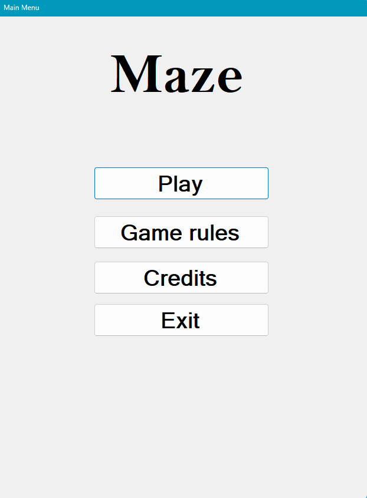
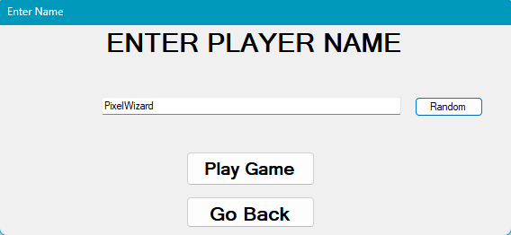
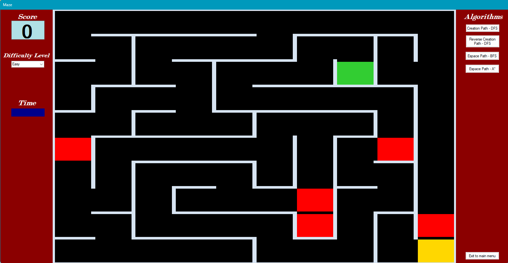
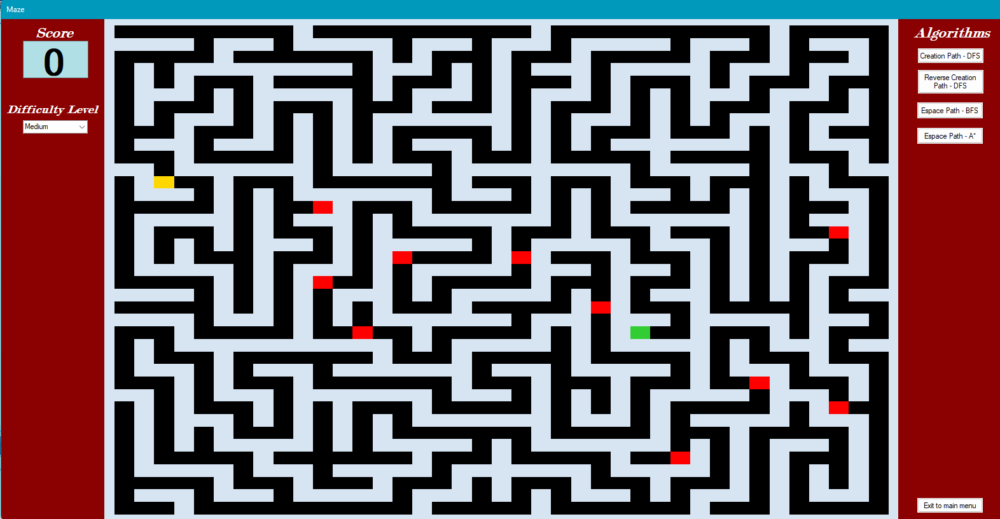
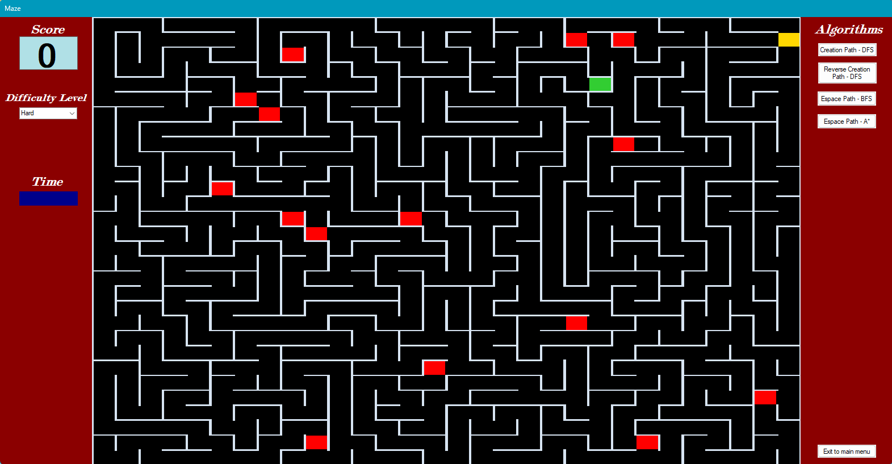
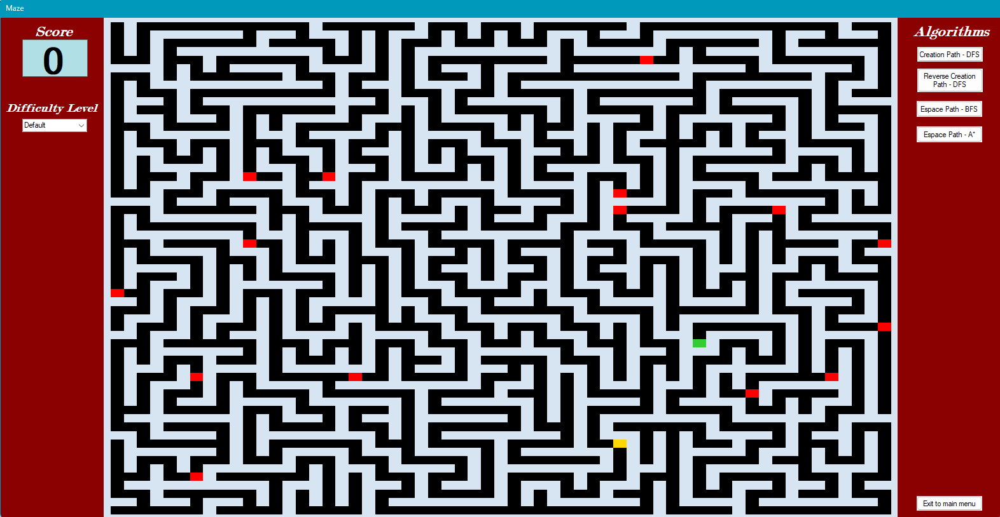
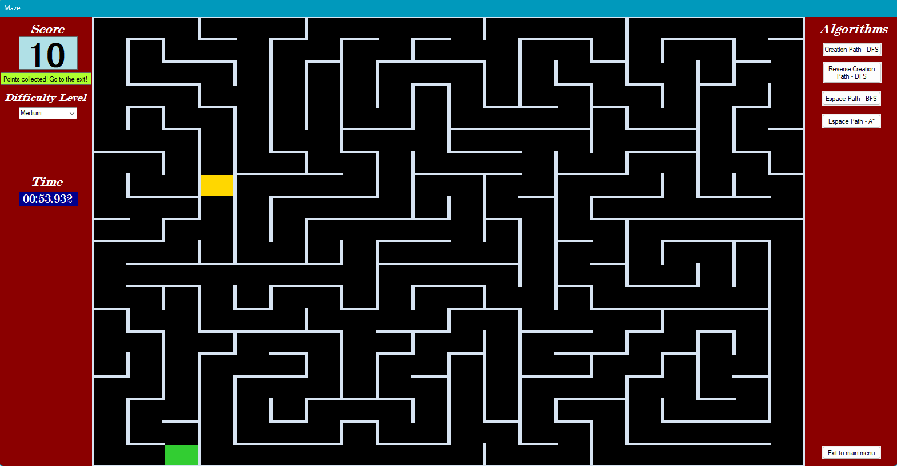
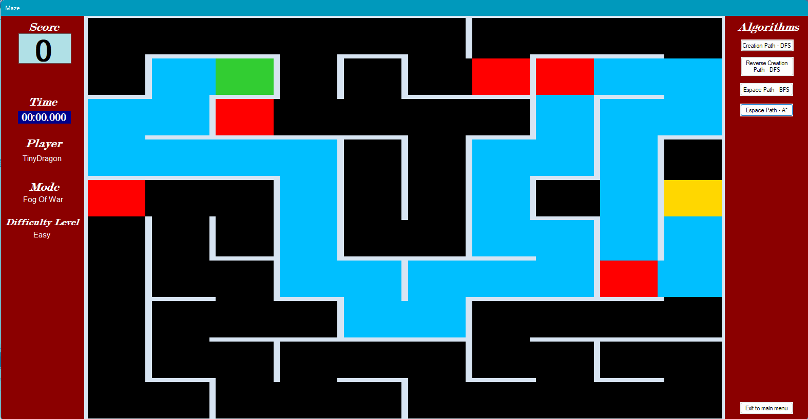
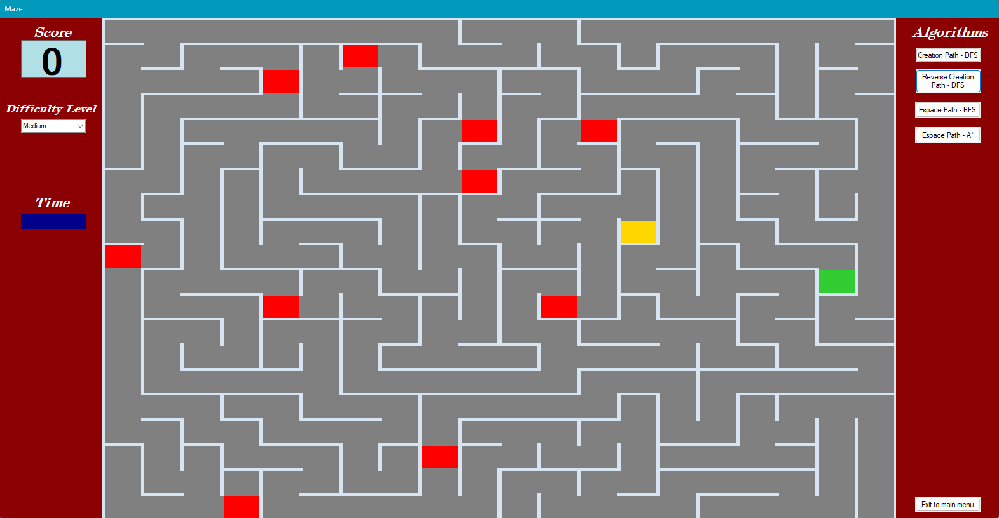
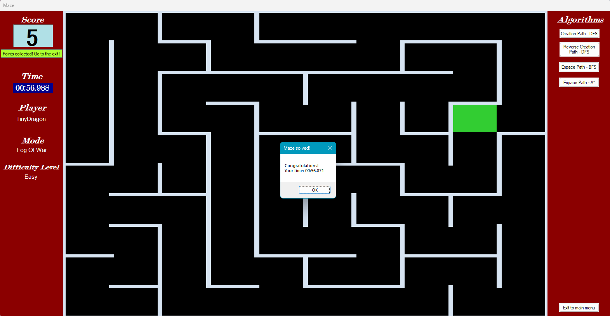

<h1><b>Maze Game</b> </h1>

This project is an updated version of a simple maze generator based on the <b>DFS (Depth-First Search)</b> algorithm, expanded into a small maze game.

 
<b><h2>Features</h2></b>
<ul>
  <li>Maze generation using <b>DFS</b> (from start to end and from end to start).</li>
  <li>Player name input without saving it in current session.</li>
  <li>Player and exit cells.</li>
  <li>Event cells that increase the player's score.</li>
  <li>Locked exit that unlocks only after all event cells have been collected.</li>
  <li>Escape path visualization using <b>BFS (Breadth-First Search)</b> and <b>A*</b> algorithms.</li>
  <li>Path animation reversal.</li>
  <li>Difficulty level selection (changing the difficulty starts a new game and resets the current score).</li>
  <li>Simple graphical user interface.</li>
  <li>In-game background music.</li>
  <li>Random teleport event for each difficulty level.</li>
  <li>Scoreboard section without saved times for now.</li>
  <li>Working timer for each gameplay.</li>
</ul>

<b><h2>Currently under development</h2></b>
<ul>
  <li>Further improvements and expansion of the <b>Game Rules</b> section.</li>
  <li>Further improvements of UI.</li>
  <li>Improvements for Scoreboard section with best times for each difficulty level.</li>
  <li>Improvements for saving player name in current session and binding it with the achieved player time in game.</li>
  <li>Protection from enter the forbidden words.</li>
  <li>Additional music tracks and sound effects.</li>
  <li>Program documentation.</li>
</ul>

<h2><b>UI & Mechanics</b></h2>

  

  

  
  
  
  

  

<h2>Pathfinding Visuals</h2>

  
  

<h2>Victory</h2>

  

