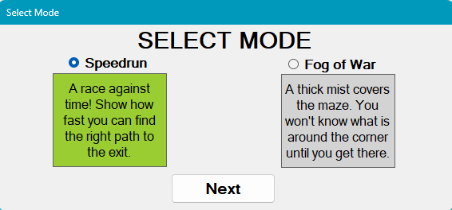
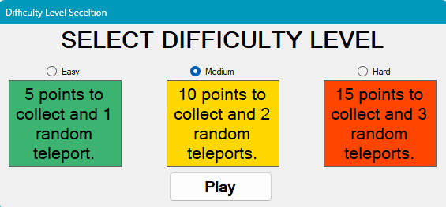

<h1><b>Maze Game</b> </h1>

This project is an updated version of a simple maze generator based on the <b>DFS (Depth-First Search)</b> algorithm, expanded into a small maze game.

 
<b><h2>Features</h2></b>
<ul>
  <li>Maze generation using <b>DFS</b> (Reveal and Rewind) - color change.</li>
  <li>Player name input with saving it in active session.</li>
  <li>Player and finish cells.</li>
  <li>Event cells that increase the player's score.</li>
  <li>Locked exit that unlocks only after all event cells have been collected.</li>
  <li>Escape path visualization using <b>BFS (Breadth-First Search)</b> and <b>A*</b> algorithms.</li>
  <li>Difficulty level selection before jump into the game.</li>
  <li>Simple graphical User Interface.</li>
  <li>In-game background music.</li>
  <li>Random teleport event for each difficulty level.</li>
  <li>Scoreboard section without saved times for now.</li>
  <li>Working timer for each gameplay.</li>
  <li>Protection against the forbidden words.</li>
  <li>Random player name generator.</li>
  <li>Player sessions to enable saving — saving is not implemented yet.</li>
  <li>Option to select one of three available modes: Speedrun (the mode do not have any logic implemented yet), Map Reveal or Fog of War (the mode do not have any logic implemented yet).</li>
</ul>

<b><h2>Currently under development</h2></b>
<ul>
  <li>Further improvements and expansion of the <b>Game Rules</b> section.</li>
  <li>Further UI improvements.</li>
  <li>Implementing Fog of War mode logic.</li>
  <li>Improving Speedrun mode.</li>
  <li>Improving Map Reveal mode.</li>
  <li>Improvements for Scoreboard section with best times for each difficulty level.</li>
  <li>Improvements for binding player name with level difficulty, mode and achieved time during active session.</li>
  <li>Allowing objects to move independently of the grid within corridors.</li>
  <li>Possible local achivement system.</li>
  <li>Additional music tracks and sound effects.</li>
  <li>Program documentation.</li>
</ul>

<h1 align="center"><b>UI & Mechanics</b></h1>

<h2><b>Main Menu</b></h2>

  

<h2><b>Enter Name, Mode & Difficulty Level Selection</b></h2>

  
  
  

<h2><b></b>Difficulty Levels</h2>

  
  
  

<h2><b>Collecting Points</b></h2>

  

<h2>Pathfinding Visuals</h2>

  
  

<h2>Victory</h2>

  

<h2><b>AI Assistance</b></h2>

  Some parts of the code were developed with the assistance of <b>Claude Sonnet 5</b>.
  AI-generated suggestions were reviewed, adapted, and integrated into the project by the author.

